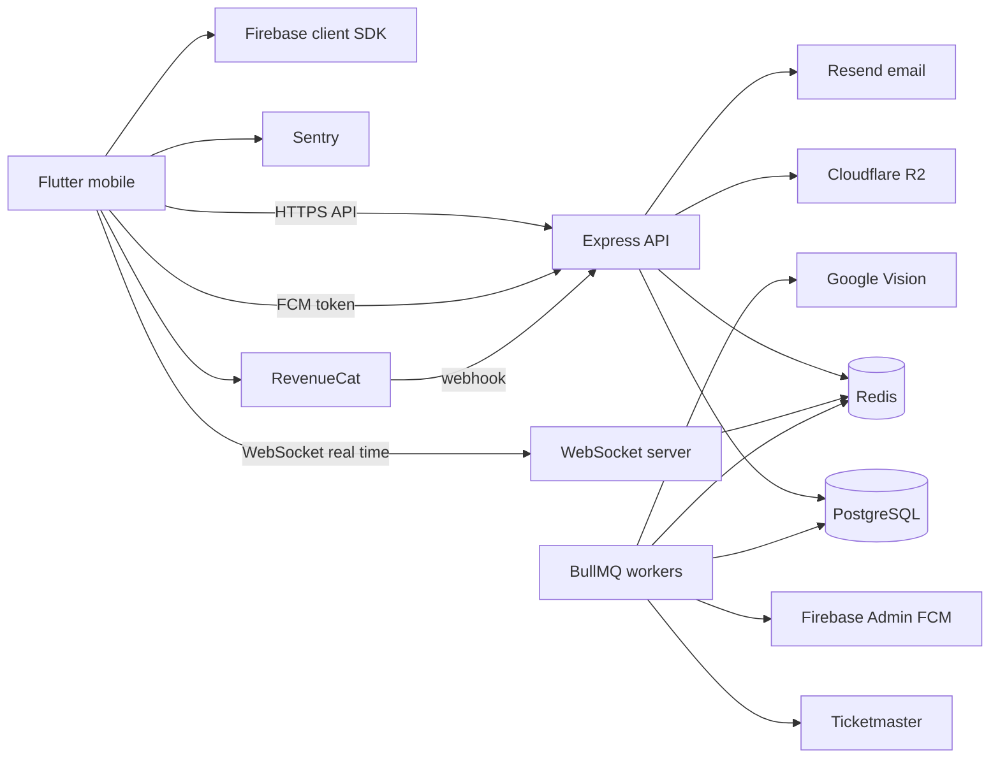
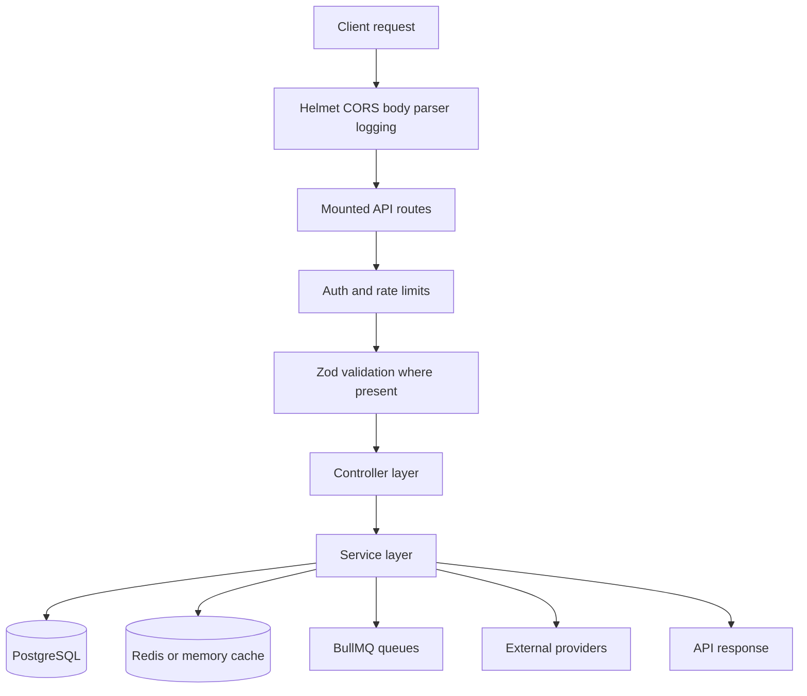
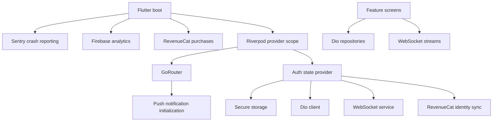
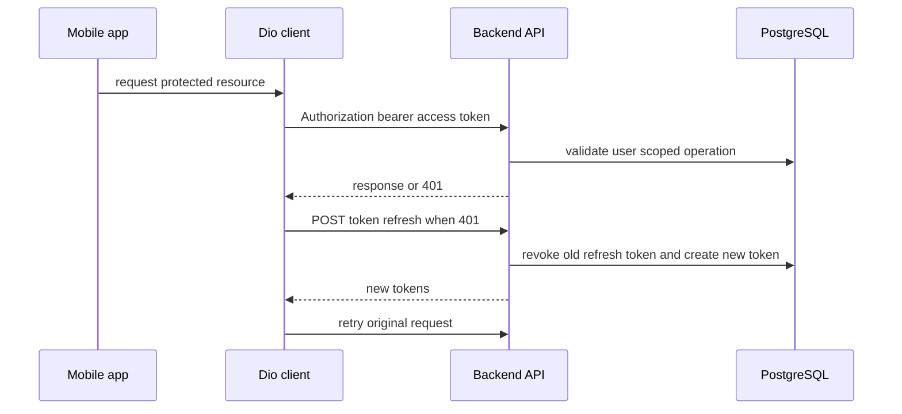
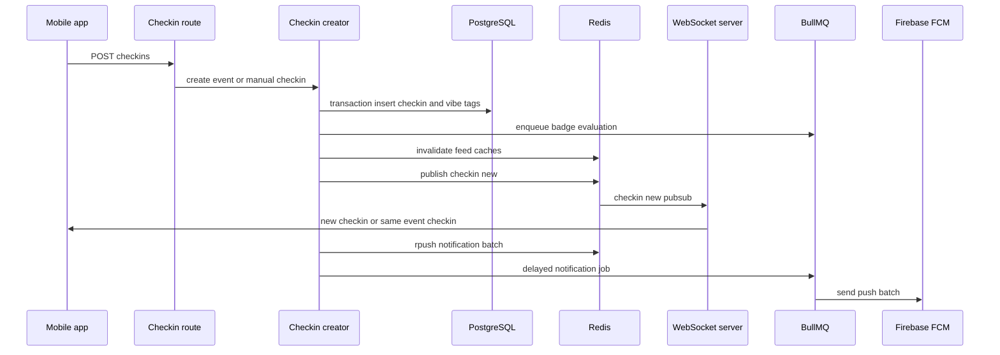
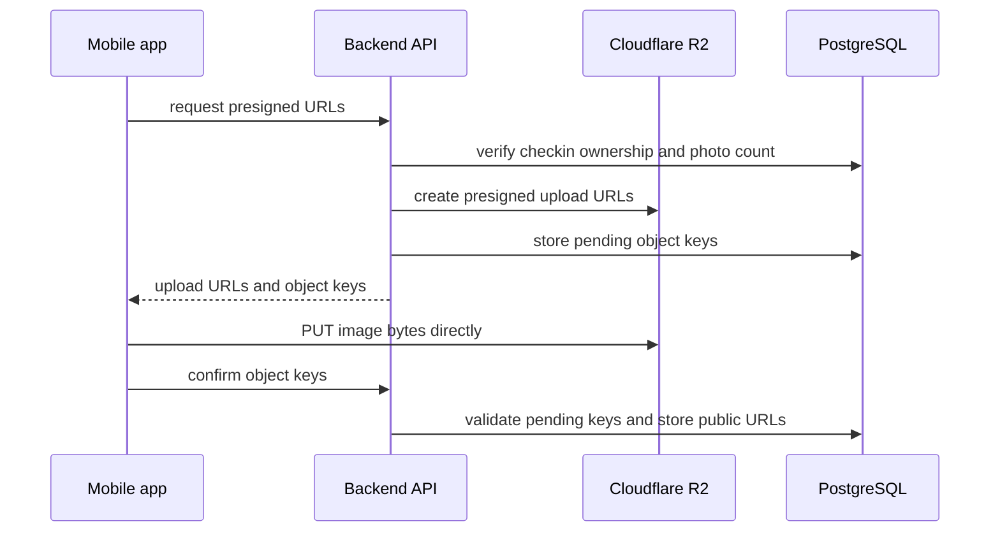
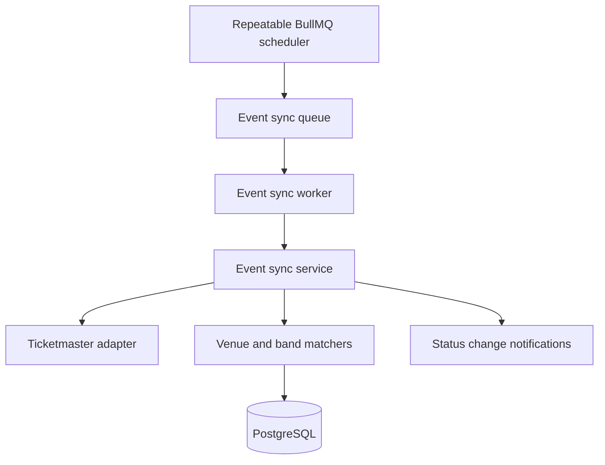

# SoundCheck Architectural Diagnostic Report

**Role:** Principal Systems Architect  
**Scope:** Backend API, background workers, mobile Flutter client, data stores, real-time streams, queue lifecycles, and external integrations.  
**Inspection method:** Static architectural review of repository guidance, backend runtime entrypoints, route/controller/service contracts, queue workers, stream services, mobile startup/auth/router/provider lifecycles, repository endpoint usage, and representative schema/persistence paths.

## 1. Executive Summary

SoundCheck is a monorepo with a TypeScript Express backend and a Flutter mobile client. The intended architecture is conventional and mostly well layered: backend requests enter through Express routes, flow to controllers, then services, with PostgreSQL as the source of truth, Redis as cache/rate-limit/pub-sub/queue substrate, BullMQ for asynchronous work, and several external providers for event ingestion, media, push, payments, analytics, and crash reporting. The mobile app uses Riverpod providers, GoRouter navigation, Dio for HTTP transport, secure storage for credentials, WebSocket streams for live events, Firebase Messaging for push, Sentry and Firebase Analytics for telemetry, and RevenueCat for subscriptions.

The review found no universal fatal flaw in the core HTTP request-response topology, but it did identify several production-impacting broken connections and incomplete streams. The most important failures are in the real-time subsystem: the backend requires a JWT during the WebSocket upgrade, while the mobile client opens the socket without providing one and only sends an auth message after connection. As a result, real-time features that depend on WebSocket connectivity are expected to fail at the handshake. A second independent real-time break exists in room routing: mobile and backend controllers use `checkin:` rooms for toast/comment updates, but the backend room whitelist only allows `event:`, `venue:`, and `user:`. Same-event detection is also incomplete because the backend checks `event:` room membership while the mobile app does not join event rooms.

The queue and data-store architecture is stronger, but there are risks around unbounded Ticketmaster recursive subdivision, high fan-out cache invalidation, mixed API error envelopes, non-idempotent push listener registration, stale device-token retention across logout, and incomplete media confirmation guarantees. These findings should be resolved before relying on real-time engagement, push notification routing, event ingestion completeness, or browser-origin clients.

## 2. System Topology

### 2.1 Runtime surfaces

| Surface | Entry point | Primary responsibilities | Notable dependencies |
|---|---|---|---|
| Backend HTTP API | [`backend/src/index.ts`](../backend/src/index.ts:94) | Express app, security middleware, route mounting, health endpoints, error handling | PostgreSQL, Redis, Sentry, BullMQ, WebSocket server |
| Backend WebSocket | [`WebSocketServer.init()`](../backend/src/utils/websocket.ts:59) | Authenticated socket upgrades, user/client indexes, room fan-out, Redis Pub/Sub fan-out | JWT, Redis Pub/Sub, Node HTTP server |
| Backend workers | [`startEventSyncWorker()`](../backend/src/jobs/eventSyncWorker.ts:29), [`startBadgeEvalWorker()`](../backend/src/jobs/badgeWorker.ts:26), [`startNotificationWorker()`](../backend/src/jobs/notificationWorker.ts:34), [`startModerationWorker()`](../backend/src/jobs/moderationWorker.ts:29) | Event ingestion, badge award evaluation, push notification batching, image moderation | Redis/BullMQ, PostgreSQL, Ticketmaster, Firebase Admin, Google Vision |
| Mobile app | [`main()`](../mobile/lib/main.dart:1) | Firebase/Sentry/Analytics/RevenueCat initialization and app launch | Firebase, Sentry, RevenueCat, Riverpod |
| Mobile provider graph | [`AuthState.build()`](../mobile/lib/src/core/providers/providers.dart:128) | Auth state, repository wiring, WebSocket connection, subscription sync, logout cleanup | Dio, secure storage, WebSocket, RevenueCat, Sentry, SharedPreferences |
| Mobile router | [`goRouter()`](../mobile/lib/src/core/router/app_router.dart:63) | Auth redirects, shell navigation, premium gating, push initialization side effect | GoRouter, Riverpod, push notifications |
| Mobile HTTP transport | [`DioClient`](../mobile/lib/src/core/api/dio_client.dart:12) | JWT injection, refresh-token retry, GET retry, error translation | Secure storage, backend API |

### 2.2 High-level topology

### 2.3 Backend request topology

The primary route table is mounted centrally in [`backend/src/index.ts`](../backend/src/index.ts:303). The system uses security middleware before route dispatch, including Helmet and CORS in [`backend/src/index.ts`](../backend/src/index.ts:105), body parsing in [`backend/src/index.ts`](../backend/src/index.ts:175), and logging in [`backend/src/index.ts`](../backend/src/index.ts:183). The global error handler returns string-based error envelopes in [`backend/src/index.ts`](../backend/src/index.ts:399), while Zod validation returns object-based error envelopes through [`buildErrorResponse()`](../backend/src/middleware/validate.ts:22).

### 2.4 Mobile runtime topology

Mobile provider composition is centralized in [`mobile/lib/src/core/providers/providers.dart`](../mobile/lib/src/core/providers/providers.dart:32). Authentication state triggers WebSocket connection and subscription sync in [`AuthState.build()`](../mobile/lib/src/core/providers/providers.dart:128), while login and registration duplicate those side effects in [`AuthState.login()`](../mobile/lib/src/core/providers/providers.dart:143) and [`AuthState.register()`](../mobile/lib/src/core/providers/providers.dart:171). Router auth changes trigger push notification initialization in [`_AuthStateNotifier`](../mobile/lib/src/core/router/app_router.dart:42).

## 3. Internal Component Inventory

### 3.1 Backend components

| Component group | Key files | Architectural role |
|---|---|---|
| Process bootstrap | [`backend/src/index.ts`](../backend/src/index.ts:1) | Loads configuration, initializes Sentry/Redis, creates Express app and HTTP server, mounts routes, starts workers, handles shutdown |
| Database | [`Database`](../backend/src/config/database.ts:1) | PostgreSQL connection pool, query helpers, health check, graceful close |
| Redis | [`createBullMQConnection()`](../backend/src/config/redis.ts:1), [`initRedis()`](../backend/src/utils/redisRateLimiter.ts:1) | Redis connectivity split across cache/rate limiting, BullMQ, and Pub/Sub |
| HTTP routes | [`backend/src/routes`](../backend/src/routes) | Feature-specific route modules mounted under `/api` |
| Controllers | [`CheckinController`](../backend/src/controllers/CheckinController.ts:9), [`EventController`](../backend/src/controllers/EventController.ts:17) | Request parsing, auth preconditions, response envelopes, thin orchestration |
| Services | [`CheckinCreatorService`](../backend/src/services/checkin/CheckinCreatorService.ts:37), [`FeedService`](../backend/src/services/FeedService.ts:71), [`EventService`](../backend/src/services/EventService.ts:23) | Business logic, DB orchestration, cache invalidation, async side effects |
| Real-time | [`WebSocketServer`](../backend/src/utils/websocket.ts:51) | Socket authentication, room membership, Pub/Sub fan-out, user-directed messages |
| Queues | [`eventSyncQueue`](../backend/src/jobs/queue.ts:23), [`badgeEvalQueue`](../backend/src/jobs/badgeQueue.ts:20), [`notificationQueue`](../backend/src/jobs/notificationQueue.ts:22), [`moderationQueue`](../backend/src/jobs/moderationQueue.ts:1) | Persistent background job transport backed by Redis |
| External adapters | [`TicketmasterAdapter`](../backend/src/services/TicketmasterAdapter.ts:43), [`R2Service`](../backend/src/services/R2Service.ts:1), [`PushNotificationService`](../backend/src/services/PushNotificationService.ts:47), [`SubscriptionService`](../backend/src/services/SubscriptionService.ts:10) | Provider-specific access and failure isolation |

### 3.2 Mobile components

| Component group | Key files | Architectural role |
|---|---|---|
| Boot | [`mobile/lib/main.dart`](../mobile/lib/main.dart:1) | Initializes telemetry, analytics, subscriptions, and root provider scope |
| API config | [`ApiConfig`](../mobile/lib/src/core/api/api_config.dart:9) | Environment-specific API, WebSocket, and public web origins |
| HTTP transport | [`DioClient`](../mobile/lib/src/core/api/dio_client.dart:12) | Auth header injection, token refresh, retry policy, error normalization |
| Provider graph | [`mobile/lib/src/core/providers/providers.dart`](../mobile/lib/src/core/providers/providers.dart:32) | Repository/service singletons and auth state orchestration |
| Routing | [`goRouter()`](../mobile/lib/src/core/router/app_router.dart:63) | Auth redirects, onboarding redirect, premium screen gating, navigation shell |
| WebSocket client | [`WebSocketService`](../mobile/lib/src/core/services/websocket_service.dart:57) | Socket lifecycle, reconnect, ping, room join, message stream controllers |
| Push client | [`PushNotificationService`](../mobile/lib/src/core/services/push_notification_service.dart:21) | FCM permission/token registration, foreground local notifications, tap deep-link parsing |
| Feed state | [`FeedWebSocketListenerMixin`](../mobile/lib/src/features/feed/presentation/providers/feed_providers.dart:249) | WebSocket feed listeners, unseen count invalidation, happening-now refresh |
| Badge UI stream | [`BadgeCollectionScreen`](../mobile/lib/src/features/badges/presentation/badge_collection_screen.dart:44) | Listens for badge-earned WebSocket messages and refreshes badge providers |

## 4. Critical Execution Pathways and Data Streams

### 4.1 Backend startup and shutdown

1. Environment variables are loaded before dependent imports in [`backend/src/index.ts`](../backend/src/index.ts:1).
2. Sentry initializes before other runtime imports in [`backend/src/index.ts`](../backend/src/index.ts:10).
3. Redis initializes for distributed cache/rate-limit state in [`backend/src/index.ts`](../backend/src/index.ts:19).
4. Express security middleware, CORS, body parsers, routes, health endpoints, and error handlers are registered in [`backend/src/index.ts`](../backend/src/index.ts:105).
5. WebSocket is attached to the HTTP server in [`backend/src/index.ts`](../backend/src/index.ts:453).
6. BullMQ workers are started after the HTTP server begins listening in [`backend/src/index.ts`](../backend/src/index.ts:466).
7. Shutdown closes HTTP, workers, Sentry, Redis, WebSocket, and PostgreSQL in [`backend/src/index.ts`](../backend/src/index.ts:481).

### 4.2 Mobile startup and auth side effects

1. Mobile startup initializes crash reporting, analytics, and RevenueCat before `ProviderScope` in [`mobile/lib/main.dart`](../mobile/lib/main.dart:1).
2. `AuthState.build()` obtains the current user, then connects WebSocket and syncs subscription state if a user exists in [`mobile/lib/src/core/providers/providers.dart`](../mobile/lib/src/core/providers/providers.dart:128).
3. Login and registration repeat WebSocket connection and subscription sync in [`mobile/lib/src/core/providers/providers.dart`](../mobile/lib/src/core/providers/providers.dart:143).
4. Logout disconnects WebSocket, logs out RevenueCat, invalidates user-scoped providers, removes SharedPreferences keys, clears secure storage through repository logout, clears Sentry/analytics identity, then sets auth state to null in [`mobile/lib/src/core/providers/providers.dart`](../mobile/lib/src/core/providers/providers.dart:211).

### 4.3 HTTP auth and token refresh

The mobile interceptor injects the JWT in [`DioClient._initializeInterceptors()`](../mobile/lib/src/core/api/dio_client.dart:38). Refresh is handled through `/tokens/refresh` in [`DioClient._attemptTokenRefresh()`](../mobile/lib/src/core/api/dio_client.dart:133), while backend token rotation uses a transaction in [`backend/src/routes/tokenRoutes.ts`](../backend/src/routes/tokenRoutes.ts:76).

### 4.4 Check-in creation, feed invalidation, WebSocket, badge, and push stream

The event-first path is implemented in [`CheckinCreatorService.createEventCheckin()`](../backend/src/services/checkin/CheckinCreatorService.ts:59). Post-commit async side effects include badge queue enqueue in [`backend/src/services/checkin/CheckinCreatorService.ts`](../backend/src/services/checkin/CheckinCreatorService.ts:164), follower lookup and cache invalidation in [`backend/src/services/checkin/CheckinCreatorService.ts`](../backend/src/services/checkin/CheckinCreatorService.ts:183), Redis Pub/Sub publishing and push batching in [`backend/src/services/checkin/CheckinCreatorService.ts`](../backend/src/services/checkin/CheckinCreatorService.ts:721), and WebSocket fan-out in [`WebSocketServer.handleCheckinPubSub()`](../backend/src/utils/websocket.ts:203).

### 4.5 Feed retrieval

Feed endpoints are mounted under `/api/feed` in [`backend/src/routes/feedRoutes.ts`](../backend/src/routes/feedRoutes.ts:15). The friends, global, event, happening-now, unseen-count, and read-cursor paths are implemented in [`FeedService`](../backend/src/services/FeedService.ts:71). Mobile repositories call the backend feed endpoints from [`FeedRepository`](../mobile/lib/src/features/feed/data/feed_repository.dart:31), and feed UI refreshes in response to WebSocket streams through [`FeedWebSocketListenerMixin`](../mobile/lib/src/features/feed/presentation/providers/feed_providers.dart:249).

### 4.6 Direct photo upload stream

The backend validates ownership and stores pending object keys in [`CheckinPhotoService.requestPhotoUploadUrls()`](../backend/src/services/checkin/CheckinPhotoService.ts:45). Confirmation verifies the object keys were issued to that check-in and user in [`CheckinPhotoService.addPhotos()`](../backend/src/services/checkin/CheckinPhotoService.ts:119). The mobile upload flow requests URLs, performs direct PUTs, and confirms keys in [`mobile/lib/src/features/checkins/data/upload_repository.dart`](../mobile/lib/src/features/checkins/data/upload_repository.dart:59).

### 4.7 Event sync stream

Event sync queueing is configured in [`eventSyncQueue`](../backend/src/jobs/queue.ts:23), recurring jobs are registered through [`registerSyncJobs()`](../backend/src/jobs/syncScheduler.ts:1), and the worker dispatches scheduled, cancellation, region, and retention jobs in [`startEventSyncWorker()`](../backend/src/jobs/eventSyncWorker.ts:29). Ticketmaster fetching and recursive date subdivision are in [`TicketmasterAdapter.fetchAllEventsForRegion()`](../backend/src/services/TicketmasterAdapter.ts:112).

### 4.8 Badge and notification streams

Badge evaluation jobs are enqueued after check-ins and processed by [`startBadgeEvalWorker()`](../backend/src/jobs/badgeWorker.ts:26). New badge awards create persistent notifications and send WebSocket events in [`BadgeService.evaluateAndAward()`](../backend/src/services/BadgeService.ts:83). Mobile listens for badge-earned messages in [`BadgeCollectionScreen._listenForBadgeEarned()`](../mobile/lib/src/features/badges/presentation/badge_collection_screen.dart:67).

Push notifications are batched in Redis lists and sent by [`startNotificationWorker()`](../backend/src/jobs/notificationWorker.ts:34). FCM device tokens are registered through `/api/users/device-token` in [`backend/src/routes/userRoutes.ts`](../backend/src/routes/userRoutes.ts:147) and on mobile through [`PushNotificationService._sendTokenToBackend()`](../mobile/lib/src/core/services/push_notification_service.dart:224).

### 4.9 Subscription stream

Mobile initializes and logs in to RevenueCat through [`SubscriptionService`](../mobile/lib/src/features/subscription/presentation/subscription_service.dart:1) and syncs local premium state in [`AuthState._syncSubscriptionState()`](../mobile/lib/src/core/providers/providers.dart:289). Backend subscription status is persisted on the user row and updated idempotently from RevenueCat webhooks in [`SubscriptionService.processWebhookEvent()`](../backend/src/services/SubscriptionService.ts:17). Backend exposes `/api/subscription/status` through [`backend/src/routes/subscriptionRoutes.ts`](../backend/src/routes/subscriptionRoutes.ts:21).

## 5. Failure Catalog

### AR-001 Critical: WebSocket authentication contract mismatch breaks real-time connectivity

**Observed structure**

Backend WebSocket upgrade validation requires a token in the URL query string or Authorization header before accepting the connection in [`WebSocketServer.init()`](../backend/src/utils/websocket.ts:65). If no token is present, it rejects the upgrade with 401 in [`backend/src/utils/websocket.ts`](../backend/src/utils/websocket.ts:75). The mobile client opens the socket with `WebSocketChannel.connect(Uri.parse(_wsUrl))` in [`WebSocketService.connect()`](../mobile/lib/src/core/services/websocket_service.dart:122), waits for readiness, and only then sends an `auth` message in [`mobile/lib/src/core/services/websocket_service.dart`](../mobile/lib/src/core/services/websocket_service.dart:154).

**Failure mode**

The post-connect auth message is unreachable because the backend rejects unauthenticated upgrades. This breaks all WebSocket-dependent paths: friend check-in banners, same-event alerts, badge-earned toasts, check-in toast/comment room messages, and user-targeted notification messages.

**Impact**

High user-visible impact. Real-time product features are effectively offline even if `ENABLE_WEBSOCKET=true` is set.

**Remediation**

- Update mobile WebSocket connection to send the JWT during the upgrade, using `ApiConfig.wsBaseUrl` from [`ApiConfig.wsBaseUrl`](../mobile/lib/src/core/api/api_config.dart:50) plus a token query parameter or a supported Authorization header path.
- Keep the backend pre-upgrade validation, because it is the stronger security posture.
- Add an integration test proving a valid token connects and a missing/invalid token fails.
- Add a mobile service test verifying the constructed WebSocket URI includes the access token before connection.

### AR-002 Critical: Check-in room prefix mismatch makes toast/comment room updates non-functional

**Observed structure**

The backend accepts only `event:`, `venue:`, and `user:` rooms in [`WebSocketServer.joinRoom()`](../backend/src/utils/websocket.ts:316). The mobile client joins `checkin:` rooms in [`WebSocketService.joinCheckinRoom()`](../mobile/lib/src/core/services/websocket_service.dart:239). The backend broadcasts toast and comment updates to `checkin:` rooms in [`CheckinController.toastCheckin()`](../backend/src/controllers/CheckinController.ts:149) and [`CheckinController.addComment()`](../backend/src/controllers/CheckinController.ts:217).

**Failure mode**

Authenticated clients attempting to join `checkin:` rooms receive an invalid-room error. The server then broadcasts to rooms that clients cannot enter.

**Impact**

Check-in detail screens cannot receive room-scoped toast/comment updates. Owner-directed `sendToUser()` notifications may still work if WebSocket connectivity is fixed, but shared room updates remain broken.

**Remediation**

- Add `checkin:` to the backend whitelist with UUID format validation.
- Consider access policy: allow any authenticated user to join public check-in rooms, or only users allowed to view that check-in.
- Add backend tests for joining `checkin:` rooms and rejecting malformed room names.
- Add mobile tests for joining/leaving room lifecycle in check-in detail screens.

### AR-003 High: Same-event real-time dependency is incomplete

**Observed structure**

Backend same-event fan-out checks whether follower users are currently in `event:<eventId>` rooms in [`WebSocketServer.handleCheckinPubSub()`](../backend/src/utils/websocket.ts:203). Mobile has generic room join methods in [`WebSocketService.joinRoom()`](../mobile/lib/src/core/services/websocket_service.dart:205) and an `ActiveEventIds` provider in [`ActiveEventIds`](../mobile/lib/src/features/feed/presentation/providers/feed_providers.dart:225), but repository search found no mobile feature code that joins `event:` rooms. Search results only found `joinCheckinRoom()` in [`WebSocketService`](../mobile/lib/src/core/services/websocket_service.dart:239).

**Failure mode**

The backend can only send `same_event_checkin` when followers are in event rooms, but the mobile app never establishes that room membership. Same-event alerts are therefore structurally unavailable.

**Impact**

The high-value live social moment, represented in mobile by [`FeedWebSocketListenerMixin`](../mobile/lib/src/features/feed/presentation/providers/feed_providers.dart:270), is non-functional.

**Remediation**

- Populate active event IDs from today’s check-ins or check-in success responses.
- Join `event:<eventId>` rooms after check-in, on event detail entry, and on app startup for active events.
- Leave event rooms when no longer relevant.
- Alternatively move same-event detection server-side by querying event attendance instead of relying on room membership.

### AR-004 High: WebSocket disconnect lifecycle retains credentials and can reconnect unexpectedly

**Observed structure**

Mobile `disconnect()` cancels timers/subscription and closes the sink, but does not clear `_authToken` or `_userId` in [`WebSocketService.disconnect()`](../mobile/lib/src/core/services/websocket_service.dart:166). Reconnection is scheduled when errors or disconnects occur, and the timer reconnects if `_authToken` is not null in [`WebSocketService._scheduleReconnect()`](../mobile/lib/src/core/services/websocket_service.dart:363).

**Failure mode**

A stale credential can remain after manual disconnect or logout. The current implementation cancels the reconnect timer during `disconnect()`, but any later socket error/done path or future service reuse can reconnect with a stale token because credentials remain in memory.

**Impact**

Potential privacy/session-boundary leak, especially on shared devices or rapid logout/login sequences.

**Remediation**

- Add a manual-disconnect flag to suppress reconnect after intentional disconnect.
- Clear `_authToken` and `_userId` on logout/manual disconnect.
- Provide `disconnect(clearCredentials: true)` for logout and `disconnect(clearCredentials: false)` for transient network resets if needed.
- Add tests for logout ensuring no reconnect timer can reconnect.

### AR-005 High: Push notification initialization is not idempotent and may duplicate listeners

**Observed structure**

Router auth-listener side effects call `PushNotificationService.initialize()` whenever auth state emits a non-null user in [`_AuthStateNotifier`](../mobile/lib/src/core/router/app_router.dart:42). The service registers FCM token refresh, foreground-message, and opened-app listeners every time `initialize()` runs in [`PushNotificationService.initialize()`](../mobile/lib/src/core/services/push_notification_service.dart:41). There is no initialized guard before listener registration; `isInitialized` only reflects `_currentToken != null` in [`mobile/lib/src/core/services/push_notification_service.dart`](../mobile/lib/src/core/services/push_notification_service.dart:29).

**Failure mode**

Repeated auth emissions can register duplicate stream listeners. Foreground notifications can be displayed multiple times, token refresh can call the backend repeatedly, and notification taps can emit duplicate navigation signals.

**Impact**

User-visible notification duplication and unnecessary backend writes.

**Remediation**

- Add a strict idempotence guard and an in-flight initialization future.
- Store stream subscriptions for token refresh, foreground messages, and opened-app handling.
- Add a `dispose()` or `resetForLogout()` method to cancel subscriptions if the service should be session-scoped.
- Ensure initial-message handling occurs once.

### AR-006 High: Device tokens are not unregistered on logout

**Observed structure**

Backend supports deleting a device token in [`backend/src/routes/userRoutes.ts`](../backend/src/routes/userRoutes.ts:180). Mobile logout disconnects WebSocket, logs out RevenueCat, clears providers and local credentials in [`AuthState.logout()`](../mobile/lib/src/core/providers/providers.dart:211), but there is no call to unregister the current FCM token before clearing auth state.

**Failure mode**

A device token can remain associated with a prior user after logout. If another user logs in on the same device, the same token can become associated with multiple users unless constrained by schema or cleanup. The previous account can continue receiving pushes on a device where it is no longer logged in.

**Impact**

Privacy and notification correctness risk.

**Remediation**

- On logout, read the current token from [`PushNotificationService.currentToken`](../mobile/lib/src/core/services/push_notification_service.dart:32) and call backend `DELETE /api/users/device-token` before deleting auth credentials.
- Consider a backend uniqueness rule on device token to associate a token with one current user, or replace prior owner during registration.
- Add logout tests validating token deletion is attempted while the JWT is still available.

### AR-007 High: Push notification tap payloads do not contain enough routing data

**Observed structure**

The notification worker sends single friend-check-in push data with only `{ type: 'friend_checkin' }` in [`notificationWorker`](../backend/src/jobs/notificationWorker.ts:90) and batch data with type/count in [`backend/src/jobs/notificationWorker.ts`](../backend/src/jobs/notificationWorker.ts:100). Mobile deep-link parsing expects `deepLink`, `notificationId`, `checkinId`, `bandId`, `venueId`, `userId`, or `showId` in [`PushNotificationService._parseDeepLink()`](../mobile/lib/src/core/services/push_notification_service.dart:184).

**Failure mode**

Tapping friend-check-in push notifications cannot navigate to a relevant screen because the payload lacks a recognized target.

**Impact**

Push notification engagement loses the intended conversion path.

**Remediation**

- Include `checkinId` for single check-in notifications.
- Include a feed or notifications deep link for batch notifications.
- Prefer a canonical `deepLink` field for all push payloads.
- Add end-to-end tests for push data payload parsing.

### AR-008 Medium: Badge real-time toasts depend on broken WebSocket path

**Observed structure**

Badge award evaluation sends a `badge_earned` WebSocket event in [`BadgeService.evaluateAndAward()`](../backend/src/services/BadgeService.ts:172). Mobile listens for `badge_earned` in [`BadgeCollectionScreen._listenForBadgeEarned()`](../mobile/lib/src/features/badges/presentation/badge_collection_screen.dart:67).

**Failure mode**

Because AR-001 breaks the WebSocket connection, badge-earned real-time toasts do not reach the client. Persistent badge notifications are still created in the backend, so the failure is in live delivery rather than data persistence.

**Impact**

Reduced gamification feedback loop.

**Remediation**

- Resolve AR-001 first.
- Add WebSocket delivery tests for badge-earned events after badge worker completion.

### AR-009 High: Ticketmaster recursive subdivision lacks a termination guard

**Observed structure**

When Ticketmaster reports more than 1000 results, the adapter clears the first page and recursively calls `fetchAllEventsForRegion()` for the first and second date halves in [`TicketmasterAdapter.fetchAllEventsForRegion()`](../backend/src/services/TicketmasterAdapter.ts:138). The midpoint is computed by dividing timestamp distance in [`TicketmasterAdapter.getMidpointDate()`](../backend/src/services/TicketmasterAdapter.ts:316).

**Failure mode**

There is no minimum interval, maximum recursion depth, or equality guard. If Ticketmaster continues returning more than 1000 results for a very small date window, or if midpoint formatting no longer changes the range, recursion can continue until stack exhaustion or quota exhaustion.

**Impact**

Potential event-sync worker failure, daily quota exhaustion, Redis queue retry churn, and partial ingestion.

**Remediation**

- Add a maximum recursion depth.
- Add a minimum time-window threshold.
- If the midpoint equals either boundary, stop subdivision and return the paged subset with an explicit truncation warning.
- Add metrics for truncated ranges and queue failures.

### AR-010 Medium: Ticketmaster rate-limit implementation can burst external calls

**Observed structure**

Remaining Ticketmaster pages are fetched via `Promise.all()` in [`TicketmasterAdapter.fetchAllEventsForRegion()`](../backend/src/services/TicketmasterAdapter.ts:167), while per-page delay uses `page * 200ms` in [`TicketmasterAdapter.fetchPageWithDelay()`](../backend/src/services/TicketmasterAdapter.ts:432). The adapter comment states it must stay under 5 requests per second in [`backend/src/services/TicketmasterAdapter.ts`](../backend/src/services/TicketmasterAdapter.ts:8).

**Failure mode**

The first page plus delayed pages can produce a compact burst around one second. Across regions, retries, or concurrent callers, this is not a global rate limiter.

**Impact**

Increased risk of provider throttling and incomplete event sync.

**Remediation**

- Replace per-call delays with a shared token-bucket or queue limiter.
- Keep event-sync worker concurrency at one, but also protect on-demand lookup paths.
- Add provider response handling for HTTP 429 with backoff.

### AR-011 Medium: API error response contract is inconsistent with mobile parsing

**Observed structure**

Validation errors use a nested error object via [`buildErrorResponse()`](../backend/src/middleware/validate.ts:22). Global errors use a string `error` field in [`backend/src/index.ts`](../backend/src/index.ts:399). Mobile `DioClient.handleDioError()` turns any `error` field into `toString()` in [`mobile/lib/src/core/api/dio_client.dart`](../mobile/lib/src/core/api/dio_client.dart:262), which turns nested validation objects into object string output rather than user-facing messages.

**Failure mode**

Users may see non-actionable error strings for validation failures, while client-side error handling cannot reliably distinguish validation, auth, conflict, or server errors.

**Impact**

Poor UX and fragile client error handling.

**Remediation**

- Standardize all backend errors to one envelope, preferably `{ success: false, error: { code, message, details } }`.
- Update mobile parsing to prefer `error.message` when `error` is a map.
- Add contract tests for validation, auth, conflict, rate limit, and server errors.

### AR-012 Medium: Browser-origin clients cannot use PATCH because CORS method list omits PATCH

**Observed structure**

Backend CORS allows `GET`, `POST`, `PUT`, `DELETE`, and `OPTIONS` in [`backend/src/index.ts`](../backend/src/index.ts:169). Mobile and backend use PATCH for check-in ratings and photo confirmation in [`backend/src/routes/checkinRoutes.ts`](../backend/src/routes/checkinRoutes.ts:130) and [`backend/src/routes/checkinRoutes.ts`](../backend/src/routes/checkinRoutes.ts:140).

**Failure mode**

Native mobile apps usually send no browser origin, so they are not affected. Any browser-origin client or web build using PATCH will fail preflight.

**Impact**

Non-functional PATCH flows for web clients.

**Remediation**

- Add `PATCH` to allowed CORS methods.
- Add a CORS preflight test for PATCH endpoints.

### AR-013 Medium: High fan-out cache invalidation can become a Redis bottleneck

**Observed structure**

After each check-in, the backend invalidates friends feed and happening-now cache for every follower, event feed cache, creator cache, and global feed cache in [`CheckinCreatorService.invalidateFeedCachesForCheckin()`](../backend/src/services/checkin/CheckinCreatorService.ts:686). It pushes all invalidations into an array and awaits `Promise.all()` in [`backend/src/services/checkin/CheckinCreatorService.ts`](../backend/src/services/checkin/CheckinCreatorService.ts:693).

**Failure mode**

Users with large follower counts can generate many concurrent Redis scan/delete operations. Combined with global feed pattern deletion, check-ins from popular users can cause cache invalidation storms.

**Impact**

Redis latency spikes, degraded feed performance, and increased contention with rate limiting, queues, Pub/Sub, and notification batching.

**Remediation**

- Replace per-follower pattern deletes with versioned cache keys or feed generation counters.
- Use bounded concurrency for invalidation operations.
- Avoid global pattern deletion by using a global feed version stamp.
- Add Redis operation metrics around check-in side effects.

### AR-014 Medium: Per-user rate-limit reset uses blocking Redis key scan

**Observed structure**

The per-user rate limiter uses `redis.keys(pattern)` during reset in [`PerUserRateLimiter.reset()`](../backend/src/middleware/perUserRateLimit.ts:165). Other Redis cleanup paths correctly use SCAN/UNLINK, such as [`EnumerationRateLimiter.reset()`](../backend/src/utils/redisRateLimiter.ts:390).

**Failure mode**

If reset is called in a large keyspace, `KEYS` can block Redis and impact unrelated queue/cache/rate-limit workloads.

**Impact**

Operational bottleneck during administrative or automated reset flows.

**Remediation**

- Replace `KEYS` with SCAN plus UNLINK, matching [`EnumerationRateLimiter.reset()`](../backend/src/utils/redisRateLimiter.ts:390).

### AR-015 Medium: Photo confirmation does not verify object existence before storing public URLs

**Observed structure**

Photo confirmation validates only that object keys were previously issued in [`CheckinPhotoService.addPhotos()`](../backend/src/services/checkin/CheckinPhotoService.ts:143), then stores public URLs in the check-in row in [`backend/src/services/checkin/CheckinPhotoService.ts`](../backend/src/services/checkin/CheckinPhotoService.ts:170). It does not HEAD the object in R2 before accepting confirmation.

**Failure mode**

The client can confirm keys that were issued but not actually uploaded, producing broken public URLs. Moderation can also be bypassed if downstream moderation is not tied to confirmed object existence.

**Impact**

Broken media display and weaker trust-and-safety guarantees.

**Remediation**

- On confirmation, verify each object exists in R2 before storing URLs.
- Store object metadata such as content length and content type.
- Enqueue moderation only after existence is verified.
- Add cleanup for expired pending object keys and orphaned uploads.

### AR-016 Medium: RevenueCat local premium state can drift from backend authorization state

**Observed structure**

Mobile sets local premium state after `SubscriptionService.isPremium()` in [`AuthState._syncSubscriptionState()`](../mobile/lib/src/core/providers/providers.dart:289). Backend premium authorization is based on the user row updated by RevenueCat webhook handling in [`SubscriptionService.processWebhookEvent()`](../backend/src/services/SubscriptionService.ts:17).

**Failure mode**

Immediately after purchase, the mobile app may consider the user premium before the backend has processed the webhook. Backend-gated endpoints can still reject premium-only requests until webhook state catches up.

**Impact**

Temporary inconsistencies in premium UX.

**Remediation**

- Add explicit client-to-backend subscription sync endpoint after purchase if RevenueCat supports secure verification.
- Make premium screens handle backend rejection gracefully and refresh subscription status.
- Expose backend subscription status in a provider that is authoritative for backend-gated content.

## 6. Data-Flow Bottlenecks and Resilience Findings

| Area | Bottleneck or failure isolation issue | Evidence | Recommendation |
|---|---|---|---|
| Redis multi-use dependency | Redis backs cache, rate limiting, Pub/Sub, and all BullMQ queues. Degradation disables several async features at once. | [`initRedis()`](../backend/src/utils/redisRateLimiter.ts:1), [`eventSyncQueue`](../backend/src/jobs/queue.ts:23), [`WebSocketServer.init()`](../backend/src/utils/websocket.ts:164) | Keep health degraded when Redis is down, add feature-level status indicators, and isolate critical rate limiting from optional cache if needed. |
| Feed invalidation | Check-in side effects can issue many cache deletes per follower. | [`CheckinCreatorService.invalidateFeedCachesForCheckin()`](../backend/src/services/checkin/CheckinCreatorService.ts:686) | Use cache version stamps and bounded concurrency. |
| Ticketmaster sync | Recursive subdivision and parallel page fetching can exhaust quota or violate rate limits. | [`TicketmasterAdapter.fetchAllEventsForRegion()`](../backend/src/services/TicketmasterAdapter.ts:112) | Add depth/time guards and global request limiter. |
| WebSocket fan-out | Pub/Sub only subscribes to `checkin:new`; toast/comment/badge use local process user maps, so multi-instance delivery depends on connection location. | [`WebSocketServer.init()`](../backend/src/utils/websocket.ts:164), [`CheckinController.toastCheckin()`](../backend/src/controllers/CheckinController.ts:149), [`BadgeService.evaluateAndAward()`](../backend/src/services/BadgeService.ts:194) | Publish all user/room real-time events through Redis Pub/Sub or a shared delivery layer in multi-instance deployments. |
| Push batching | Redis list TTL and BullMQ job dedup use one job ID per user. If enqueue fails after list push, data expires without notification. | [`CheckinCreatorService.publishCheckinAndNotify()`](../backend/src/services/checkin/CheckinCreatorService.ts:782) | Use atomic Lua or transactional pattern for list push plus queue enqueue, or tolerate with metrics and retry. |
| Error contract | Validation and global errors have different shapes. | [`buildErrorResponse()`](../backend/src/middleware/validate.ts:22), [`backend/src/index.ts`](../backend/src/index.ts:399), [`DioClient.handleDioError()`](../mobile/lib/src/core/api/dio_client.dart:262) | Standardize error envelopes and update mobile parser. |

## 7. Infinite Loop and Reconnection Analysis

No unconditional infinite loop was found in normal HTTP request handling, mobile provider rebuilds, WebSocket heartbeat, or queue workers. Most loops are bounded by collection sizes, cursor iteration, or timers. However, three loop-like risks require attention:

1. **Ticketmaster recursive subdivision:** unbounded recursion risk when provider result count remains above 1000 in an indivisible window, as described in AR-009.
2. **WebSocket reconnect after stale session:** reconnect attempts are capped at five in [`WebSocketService._scheduleReconnect()`](../mobile/lib/src/core/services/websocket_service.dart:363), so this is not infinite, but stale credentials can cross logout boundaries as described in AR-004.
3. **Push listener accumulation:** repeated `initialize()` calls can accumulate listeners without a loop in code, producing multiplicative event handling as described in AR-005.

## 8. Remediation Blueprint

### Phase 1: Restore real-time transport correctness

- Fix mobile WebSocket connection to provide JWT during the upgrade using [`ApiConfig.wsBaseUrl`](../mobile/lib/src/core/api/api_config.dart:50).
- Keep backend upgrade authentication in [`WebSocketServer.init()`](../backend/src/utils/websocket.ts:65).
- Add `checkin:` support and validation in [`WebSocketServer.joinRoom()`](../backend/src/utils/websocket.ts:316).
- Implement event room join/leave lifecycle for same-event detection.
- Clear WebSocket credentials on logout and suppress reconnect after manual disconnect in [`WebSocketService.disconnect()`](../mobile/lib/src/core/services/websocket_service.dart:166).
- Add backend and mobile tests for handshake, room join, reconnect, logout, badge event, and check-in room delivery.

### Phase 2: Stabilize push notification lifecycle and routing

- Make [`PushNotificationService.initialize()`](../mobile/lib/src/core/services/push_notification_service.dart:41) idempotent and store subscriptions.
- Add logout device-token unregister before credentials are cleared in [`AuthState.logout()`](../mobile/lib/src/core/providers/providers.dart:211).
- Include `deepLink`, `checkinId`, or `notificationId` in notification worker payloads from [`startNotificationWorker()`](../backend/src/jobs/notificationWorker.ts:34).
- Add tests for foreground notification duplication, token refresh listener count, logout token removal, and tap routing.

### Phase 3: Normalize API contracts

- Standardize all errors to a single backend envelope based on [`buildErrorResponse()`](../backend/src/middleware/validate.ts:22).
- Update [`DioClient.handleDioError()`](../mobile/lib/src/core/api/dio_client.dart:262) to extract nested `error.message` and `error.details`.
- Add `PATCH` to CORS methods in [`backend/src/index.ts`](../backend/src/index.ts:169).
- Add contract tests for validation, unauthorized, forbidden, conflict, rate-limit, and server errors.

### Phase 4: Harden async ingestion, queues, and media

- Add recursion depth, minimum window, and truncation telemetry to [`TicketmasterAdapter.fetchAllEventsForRegion()`](../backend/src/services/TicketmasterAdapter.ts:112).
- Replace per-page delay with a global Ticketmaster limiter in [`TicketmasterAdapter`](../backend/src/services/TicketmasterAdapter.ts:43).
- Replace fan-out cache deletion with versioned keys or bounded invalidation in [`CheckinCreatorService.invalidateFeedCachesForCheckin()`](../backend/src/services/checkin/CheckinCreatorService.ts:686).
- Replace Redis `KEYS` usage in [`PerUserRateLimiter.reset()`](../backend/src/middleware/perUserRateLimit.ts:165).
- Verify R2 object existence before confirming photos in [`CheckinPhotoService.addPhotos()`](../backend/src/services/checkin/CheckinPhotoService.ts:119).

### Phase 5: Observability and validation

- Expand `/health` and `/health/queues` from [`backend/src/index.ts`](../backend/src/index.ts:189) and [`backend/src/index.ts`](../backend/src/index.ts:267) with feature-level degradation indicators.
- Track WebSocket connection failures, rejected room joins, reconnect attempts, push listener count, notification tap parse failures, Ticketmaster truncations, and Redis invalidation latency.
- Run repository baseline checks documented in [`AGENTS.md`](../AGENTS.md) after implementation: backend lint, typecheck, tests, build; mobile code generation, analyzer, and tests; harness check.

## 9. Prioritized Implementation Handoff Checklist

- [ ] Update mobile WebSocket upgrade URL/header to include JWT before connecting.
- [ ] Remove or adjust redundant post-connect auth message flow after backend contract is confirmed.
- [ ] Add `checkin:` room validation and authorization on backend.
- [ ] Implement mobile event-room membership for same-event detection.
- [ ] Add logout-safe WebSocket credential clearing and reconnect suppression.
- [ ] Make push initialization idempotent and subscription-backed.
- [ ] Unregister device tokens during logout before clearing credentials.
- [ ] Add deep-link-compatible payloads to push notification worker output.
- [ ] Standardize backend error envelopes and update mobile error parsing.
- [ ] Add `PATCH` to CORS methods.
- [ ] Add Ticketmaster recursion and rate-limit guards.
- [ ] Replace fan-out cache invalidation with bounded or versioned strategy.
- [ ] Replace `KEYS` with SCAN/UNLINK in per-user rate-limit reset.
- [ ] Verify R2 object existence on photo confirmation.
- [ ] Add observability and regression tests for all corrected streams.

## 10. Architectural Verdict

SoundCheck’s static layering is mostly sound: route/controller/service separation is visible, the mobile repository/provider structure is coherent, and background work is appropriately delegated to Redis-backed queues. The main structural problem is not the overall topology; it is the mismatch between intended cross-component contracts and their actual implementation. Real-time and push systems have multiple broken or incomplete dependencies at the boundaries between mobile client, WebSocket server, Redis Pub/Sub, room authorization, and notification payload routing.

The fastest path to architectural stability is to repair the real-time handshake and room contracts first, then fix push idempotency and logout privacy, then normalize API contracts and harden long-running ingestion/media flows. After those corrections, the current architecture can support the intended product flows without requiring a major platform rewrite.
